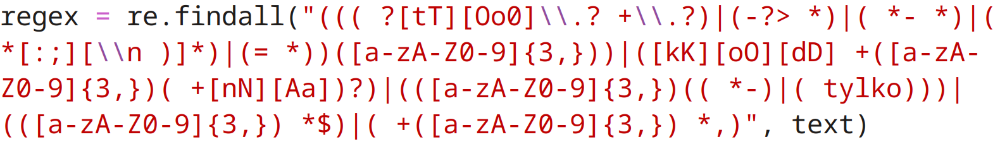

# faktmobile-kody

Retrieve and send Fakt Mobile (4-5 letter/number) codes automatically for benefits (additional minutes, SMS and internet) via SMS to 4949 from a Polish forum

## Dependencies
* python3
* selenium (using Firefox)
* termux (or a fork, and termux api)

## Installation & usage

1. Firstly, download [Termux](https://github.com/termux/termux-app), or some fork of it, launch and configure it
2. Download the [Termux:API](https://github.com/termux/termux-api) app, and configure it to enable the ability for SMS to be sent from Termux
3. In Termux, download dependencies with: `pkg install termux-api python git`
4. Clone this repository: `git clone https://github.com/netman134/faktmobile-kody`

Below further unfinished instructions:

5. Create a virtual python environment (recommended, but not required): `python -m venv venv` and source into it `source venv/bin/activate` (or when using fish/csh, add `.fish`/`.csh` at the end)
6. Install python script dependencies: `pip install selenium termux`
7. Configure working to your liking in [config.py](config.py):
    * link - if it changes, or something (str)
    * num_of_latest_codes - to be fetched and sent (int)
    * sms_send_timeout - between individual sms codes being sent (int)
    * (todo) sim - for single-sim phones: 0/1, for dual-sim check: 0/1/2 (str, <strong>most important</strong>)
    * show_toasts - on start and end (bool)
    * vibrate_at_end (bool)
    * pc_debug_no_termux - disable termux api for debugging on pc and print retrieved codes (bool)
8. (todo+venv) Setup automatic run every day/hour using cron or similar tools
9. Archive the 4949 number in the messaging app to not get notifications from 4949 and sent messages every day/hour at the top of the messages app (recommended)

# Why?
Fakt Mobile offers a package for 3 PLN, which offers 50 minutes of calls, 50 SMS messages, and 250MB of internet (+ some little EU roaming) - with this little tool I can even extend that package to 90 minutes, 90 SMS and 450MB of local data

Just (almost exclusively, with some little exceptions of course) <strong>pay only for what you really use</strong>.

# Regex. (and code)

This regex just works. I scoured through all the messages on the forum to try to match my regex to every message and I know it's very much over-complicated (for such use case, and most of today's codes posted are just 4 letters posted in similar manner), but it works. Don't dig into that, I know it's a non-readable pile of garbage.

Apart from that I tried making this little code to be as readable as it could be, and I think I achieved that pretty well :)

# License

Distributed with [MIT License](./LICENSE)
